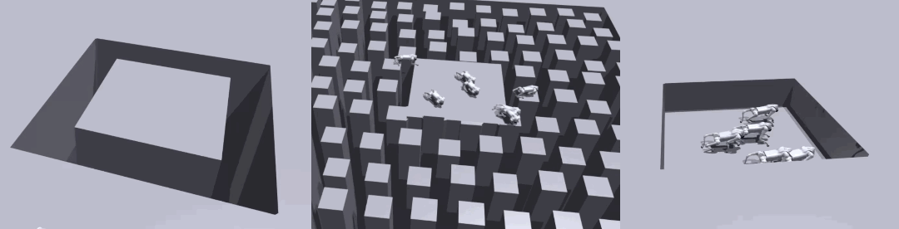

# Go2 Parkour

## Overview
This project is developed based on [legged_robot_competition](https://github.com/jindadu00/legged_robot_competition).

Compared with the original codebase, this project:
- Reuses the **velocity tracking rewards** from [legged_gym](https://github.com/leggedrobotics/legged_gym).  
- Employs a **heuristic-guided curriculum** to train a quadruped capable of traversing **stepping stones**, **gaps**, and **pit terrains**.  
- Achieves occasional success on the competition map from [legged_robot_competition](https://github.com/jindadu00/legged_robot_competition).



## Installation

```bash
git clone https://github.com/jindadu00/legged_robot_competition
```

For the remaining setup steps, please refer to the [original repository instructions](https://github.com/jindadu00/legged_robot_competition).

## Training and Playing

### Policy for Competition Map
Train using the original collection of terrains (**slope**, **stairs**, and **discrete obstacles**) along with **stepping stones** for 15,000 iterations:

```bash
python legged_gym/legged_gym/scripts/train.py --task go2 --headless
```

This should yield a policy that can occasionally traverse the competition map, even though it was not explicitly trained on it.

```bash
python legged_gym/legged_gym/scripts/play_competition.py --task go2_competition --load_run <name_of_the_above_run>
```

### Specialists for Different Terrains

```bash
# Stepping stones
python legged_gym/legged_gym/scripts/train.py --task go2_stepping --headless
python legged_gym/legged_gym/scripts/play.py --task go2_stepping

# Gap
python legged_gym/legged_gym/scripts/train.py --task go2_gap --headless
python legged_gym/legged_gym/scripts/play.py --task go2_gap

# Pit
python legged_gym/legged_gym/scripts/train.py --task go2_pit --headless
python legged_gym/legged_gym/scripts/play.py --task go2_pit
```

## TODOs
- [ ] Remove foot clearance from observations.  
- [ ] Integrate a **Mixture of Experts (MoE)** to combine policies across different terrains, inspired by [ANYmal Parkour](https://arxiv.org/abs/2306.14874).

## References
- [DreamWaQ Implementation](https://github.com/wanghg1992/DreamWaQ)  
- [PIE: Parkour with Implicit-Explicit Learning Framework for Legged Robots](https://arxiv.org/abs/2408.13740)  
- [ANYmal Parkour: Learning Agile Navigation for Quadrupedal Robots](https://arxiv.org/abs/2306.14874)  
- [Attention-Based Map Encoding for Learning Generalized Legged Locomotion](https://arxiv.org/abs/2506.09588)
